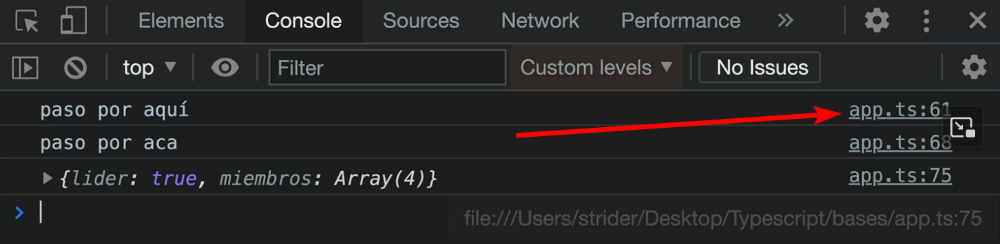
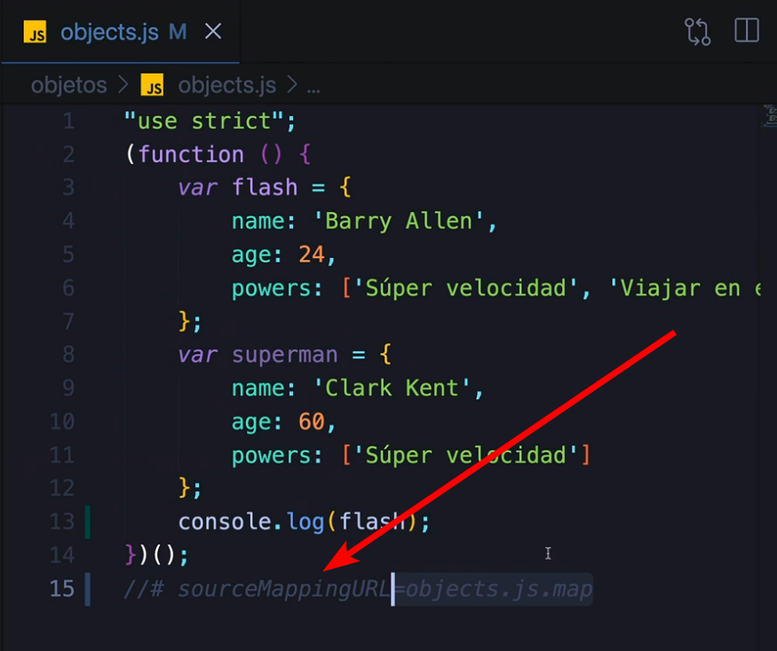
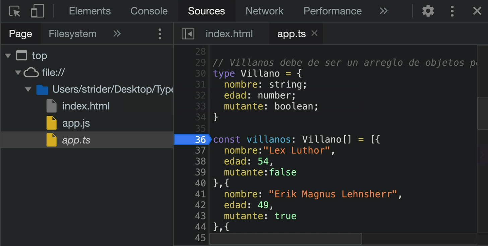
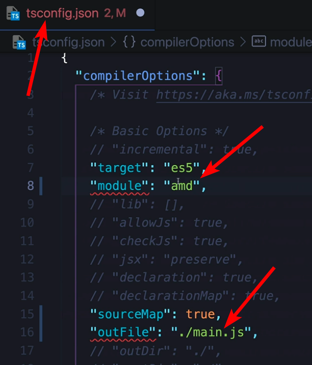
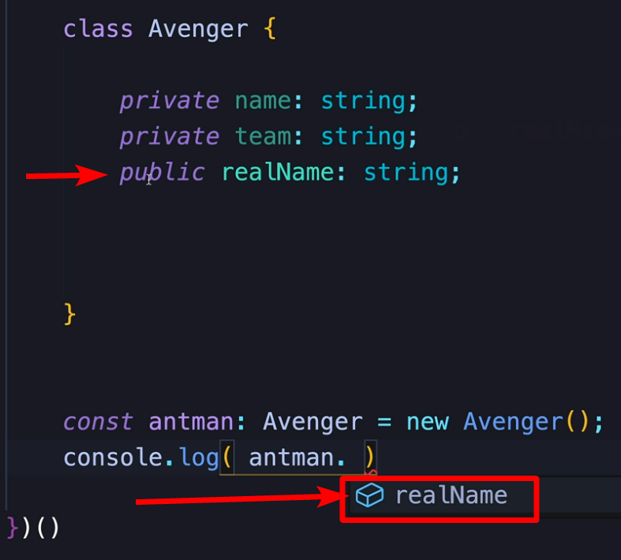

# Resources
👉👈👇👆✅❌🚧⚠️🚩🔺🔻⬅️⬆️➡️⬇️▀▀▀▄▄▄▄ ┏▼┃┣┗ ┻┗━━━━▶

https://github.com/Klerith/ts-bases/tree/fin-seccion-5

# 0. TypeScript - tipos basicos
## Commands
```ts
tsc --init

tsc -w  //watching (muestra los archivos traspilados para si quieres comparar ts con js)
```
## Conceptos
en typescript los : significan el tipo de dato, ej de tipo numerico:
const a : 10

# 3. ¿Qué son los tipos de datos
* Primitivos
    * String
    * Number
    * Boolean
    * Especiales
    * Symbol
* Compuestos
    * Objetos literales
    * Funciones
    * Clases
    * Arreglos
* TypeScript permite:
    * crear nuevos tipos
    * Interfaces
    * Genericos
    * Tuplas

Especiales:
    age = null
    hero = undefined

### Symbols
cuando se necesita dentro de un objeto garantizar que una propiedad sea unica. (dos symbols apuntan a un espacio de memoria diferente)

### Objetos literales
```ts
person = {
    name: 'John',
    age: 35
}
```

Función Anónima AutoInvocada:
esta tecnica se usa para hacer funciones autoinvocadas y así tener codigo encapsulado para hacer pruebas:
```ts
(()=> {

})
```


## 3.14. Inferir tipos y modo estricto
b da error puede volver asignarse pero esta tipado a string unicamente.
```
const a:number = 10;
let b:string;

b = 3.14;
b = {};
b = [];
b = true;
```

funciones autoinvocadas:
```ts
(()=> {
    const a:number = 10;
    console.log(a)
})()
```

Ventaja de ts: obseva como esto da error en ts pues num1 es undefind, sin embargo si usamos js da output 'es mayor'
```ts
 let num1;
 let num2: number = 10;
 
 if(num1 < num2){
    console.log('es menor')
 } else{
    console.log('es mayor)
 }
```

 tipos de String (se recomienda usar '')
 ```ts
const a: string = 'john';
const b: string = "mery";
const c: string = `peter`;
 ```

uso de ? 
(si hay algo en posicion 10, en caso contrario no hace nada)
```ts
const a: string = 'john';
console.log(a[10].toUpperCase()) 
// ERROR 
console.log(a[10]?.toUpperCase());
// undefined
console.log(a[10]?.toUpperCase() || 'missing');
// missing 
```

## 3.18 tipo any (evitar usarlo)
Nunca lo usen pues para eso usamos ts en lugar de js para tener un tipado stricto.
```ts
(()=>{
    let a:any = 123;
    a = 'john';
    console.log(a.charAt(0))
    // j
    a = 1.5
})
```

any puede ser cualquier tipo, véase como cambia de string a number
```ts
let a:any = 123;
a = 'some text';
console.log(a.chartAt(0)); // s
a = 1.5
console.log(a)
```

casting de tipo AS y de tipo <> (para hacer una excepción de tipo de en lugar de ser any lo trata como string o number y con esto se logra que al poner el punto salgan los métodos en visual studio, de otra manera no salen pues es 'any')
```ts
let a:any = 123
a = 'some text';
console.log(a as string).charAt(0) // s
a = 1.56890;
console.log(<number>a).toFixed(2); // 1.56
```


# 3.19 Arrays 
[ ] significa arreglos, tambien pueden ser tuplas.

array que admite múltiples tipos
```ts
const a: (string | number | boolean)[] = [1, 2, 3, '4',true];
a.push(true)
console.log(a) 
// 1,2,3,4,true,true

``` 

## 3.20 Tuples
```ts
const a: [string, number,boolean] = ['some text',100,true];
hero[0]='text'     //ok
hero[0]=50        //error
hero[1]=50       //ok
hero[1]='text'  //error
hero[2]=true   //ok
hero[2]=50    //error

```

## 3.21. Enum
```ts
(()=>{
    enum Level{
        min = 1,
        medium,
        medium2,
        max = 10,
    }
    
    console.log(Level.min);       //1
    console.log(Level.medium);   //2
    console.log(Level.max);     //10

    let volume: Level = Level.medium2;
    console.log(volume);      // 3
    
})()
```
example:
```ts
    (()=>{
    enum level{
        min = 0,
        medium = 50,
        max = 100
    }
    const jazz:level = level.min;
    const pop:level = level.medium;
    const rock:level = level.max;
    })()
```

## 3.22 Void, null, undefined

¿son lo mismo? **Rotundamente NO.** Son tres conceptos diferentes.

Aunque los tres representan la idea de "nada" o "vacío", se usan en contextos muy distintos. Confundirlos es la causa número 1 de bugs en aplicaciones JavaScript/TypeScript.

Aquí tienes la explicación definitiva con una analogía fácil de entender.

---

### 1. `undefined` (No inicializado) 🤷‍♂️

**"Existe, pero nadie le ha dado valor todavía".**

Es el valor por defecto que JavaScript/TypeScript asigna a las cosas que has declarado pero no has rellenado.

* **Significado:** "Todavía no sé qué es esto".
* **¿Quién lo pone?** Generalmente el **Sistema** (automáticamente), aunque tú puedes asignarlo manualmente (no recomendado).

```typescript
let usuario: string; 
console.log(usuario); // ➡️ undefined
// (La variable existe, pero la caja está vacía porque nadie metió nada)

```

### 2. `null` (Intencionalmente vacío) 📭

**"Existe, y le he puesto un valor 'vacío' a propósito".**

Se usa cuando quieres decir explícitamente que **no hay dato**. Es útil para limpiar variables o resetear formularios.

* **Significado:** "Sé que aquí no hay nada, porque yo lo he decidido".
* **¿Quién lo pone?** El **Programador**.

```typescript
let usuario: string | null;

// El usuario se loguea
usuario = "Carlos";

// El usuario hace logout (Lo vaciamos a propósito)
usuario = null; 

```

### 3. `void` (Vacío / Sin retorno) 🕳️

**"Esto es una acción, no un valor".**

`void` es exclusivo de TypeScript y se usa casi siempre en **funciones**. Indica que la función hace un trabajo (como guardar en base de datos o mostrar una alerta) pero **no devuelve ningún dato** útil para que lo recojas en una variable.

* **Significado:** "No esperes recibir nada de mí".
* **Uso:** Tipado de funciones.

```typescript
// ✅ Correcto: La función hace algo, pero no devuelve nada (return)
function mostrarAlerta(): void {
    alert("Hola!");
}

// ❌ Error lógico: Intentar guardar el resultado de una función void
const resultado = mostrarAlerta(); // ¿Qué guardas aquí? Nada.

```

---

### Resumen para tu "Cheat Sheet" mental 🧠

| Concepto | Tipo | Significado Humano | Ejemplo de la vida real |
| --- | --- | --- | --- |
| **undefined** | Valor y Tipo | "Se me olvidó rellenarlo" | Una caja de Amazon que te llega sin abrir. |
| **null** | Valor | "Lo dejé en blanco aposta" | Una casilla de formulario que dice "Opcional". |
| **void** | Solo Tipo | "No devuelve nada" | Gritar "¡Hola!" al aire (haces la acción, pero no te llevas nada físico a casa). |

### ¿Cuándo usar cuál?

1. **¿Variable sin valor inicial?** Deja que sea `undefined`.
2. **¿Resetear un campo o decir "sin selección"?** Usa `null`.
3. **¿Definir una función que no tiene `return`?** Usa `void`.

## 3.23 Never
es una funcion que usualmente va a terminar con un error.
```ts
const error =(message:string):never=>{
    throw new Error(message);
}
error('failed!');
```

## 3.24 StrictNullChecks
Pongan typescript lo mas reestrictivo, no empiecen a cambiar el archivo
un valor boolean tsconfig.json ¿para qué sino estan ustedes usando ts?

# 4. Funciones y objetos
Puntualmente tenemos:
    Declaraciones básicas de funciones
    Parámetros obligatorios
    Parámetros opcionales
    Parámetros por defecto
    Parámetros REST
    Tipo de datos "Function"


## 4.29 Funciones Parámetros
veamos 2 cosas:
1.tipado con multiples parámetros (véase lastName)
2. El tipado no quiere decir que sea infalible, fíjate en noName, ts no da error pues se le pasa un string.
```diff
(()=>{
//                                                             👇
+     const fullName = (firstName:string, lastName:(string | boolean))=>{
        return `${firstName} ${lastName}`;
})
const name = fullName('John',true);
console.log({name});

let noName:string;
const name2 = fullName(noName, 'Smith');
console.log({name})
```

## 4.30 parametros por defecto y opcionales
Aquí tienes el código exacto que aparece en la imagen transcrito para que puedas copiarlo y pegarlo:
### Puntos clave de este código:

0. **`): string =>`** es lo que hace que TypeScript sea "seguro". Se llama Tipo de Retorno (Return Type).
1. **`lastName?: string`**: El signo de interrogación indica que el parámetro es **opcional**.
2. **`upper: boolean = false`**: Establece un **valor por defecto**; si no envías ese argumento, será `false`.
3. **`|| '----'`**: Es un operador lógico que sirve de *fallback*. Si `lastName` no existe (es undefined), usará los guiones.
```typescript
(() => {
//                                               👇                   👇
    const fullName = ( firstName: string, lastName?: string, upper: boolean = false ): string => {

        if ( upper ) {
            // CASO 1: Se ejecuta si 'upper' es true
            return `${ firstName } ${ lastName || '----' }`.toUpperCase();
        } else {
            // CASO 2: Se ejecuta si 'upper' es false o no se envía nada
            return `${ firstName } ${ lastName || '----' }`;
        }

    }

    // --- PRUEBA DEL CASO 1 (El de la imagen) ---
//                                           👇
    const name = fullName( 'Tony', 'Stark', true );
    
    console.log({ name }); 
    // 📢 Output: { name: 'TONY STARK' }


    // --- PRUEBA DEL CASO 2 (Si no enviamos el 3er argumento) ---
    const nameNormal = fullName( 'Tony', 'Stark' );
    
    console.log({ nameNormal });
    // 📢 Output: { nameNormal: 'Tony Stark' }

})()
```

Parámetros REST
```typescript
(()=>{
    const fullName = (firstName: string, ...restArgs:string[]):string=>{
        return `${firstName} ${restArgs.join('')}`
    }
    const superman = fullName('john', 'mery','steve');
    console.log({superman})
})()
```

## 4.34 Tipo Function
En lugar de dejar let myFunction; (que es any y un peligro), vamos a definir la firma exacta que debe tener la variable para aceptar cada función.
```typescript
(() => {

    // --- FUNCIONES ORIGINALES ---
    const addNumbers = ( a: number, b: number ) => a + b;
    const greet = ( name: string ) => `Hola ${ name }`;
    const saveTheWorld = () => `El mundo está salvado!`;


    // ---------------------------------------------------------
    // CASO 1: Tipado para aceptar 'addNumbers'
    // ---------------------------------------------------------
    // "Esta variable SOLO acepta funciones que reciban 2 números y devuelvan un número"
    let myFunctionNumbers: (y: number, x: number) => number;

    myFunctionNumbers = addNumbers; 
    console.log( myFunctionNumbers(10, 20) ); // ✅ Correcto: 30
    
    // myFunctionNumbers = greet; // ❌ ERROR: 'greet' no devuelve un número ni recibe 2 argumentos.


    // ---------------------------------------------------------
    // CASO 2: Tipado para aceptar 'greet'
    // ---------------------------------------------------------
    // "Esta variable SOLO acepta funciones que reciban 1 string y devuelvan un string"
    let myFunctionString: (name: string) => string;

    myFunctionString = greet;
    console.log( myFunctionString('Manuel') ); // ✅ Correcto: Hola Manuel

    // myFunctionString( 1, 2 ); // ❌ ERROR: TypeScript te avisa AQUÍ (no al ejecutar) de que los argumentos están mal.


    // ---------------------------------------------------------
    // CASO 3: Tipado para aceptar 'saveTheWorld'
    // ---------------------------------------------------------
    // "Esta variable SOLO acepta funciones sin argumentos que devuelvan un string"
    let myFunctionVoid: () => string;

    myFunctionVoid = saveTheWorld;
    console.log( myFunctionVoid() ); // ✅ Correcto

})();

```

Casos de maximo tipado:
```typescript
// 1. Añadir máximo de tipados
// -------------------------------------------------
function sumar( a: number, b: number ): number {
    return a + b;
}

// Aquí definimos la firma completa de la variable
let total: ( a: number, b: number ) => number;

total = sumar;
console.log( total(2, 3) );


// 2. Tipado de Arrays y retorno
// -------------------------------------------------
const contar = ( heroes: string[] ): number => {
    return heroes.length;
}

const superHeroes: string[] = ["Flash", "Arrow", "Superman", "Linterna Verde"];
contar( superHeroes );


// 3. Parámetros por defecto (Default params)
// -------------------------------------------------
// Hemos añadido "= true" para que sea un valor por defecto real
const llamarBatman = ( llamar: boolean = true ): void => {
    if( llamar ){
        console.log("Batiseñal activada");
    }
}

llamarBatman(); // Ahora funciona sin argumentos (usa true por defecto)


// 4. Rest Parameters (El operador ...)
// -------------------------------------------------
// El rest operator junta todos los argumentos en un array de strings
const unirheroes = ( ...personas: string[] ): string => {
    return personas.join(", ");
}

// Se usa enviando argumentos sueltos:
console.log( unirheroes("Thor", "Ironman", "Spiderman") );


// 5. Tipo función complejo (Tu ejercicio final)
// -------------------------------------------------

// Primero arreglamos la función original (tenía errores de sintaxis)
const noHaceNada = ( numero: number, texto: string, booleano: boolean, arreglo: string[] ): void => {
    // No hace nada
}

// AHORA EL RETO: Crear el tipo de variable que acepte esa función
let noHaceNadaTampoco: ( n: number, t: string, b: boolean, a: string[] ) => void;

// Asignación correcta
noHaceNadaTampoco = noHaceNada;
```

# 5. Objetos y tipos personalizados en TypeScript
    Objetos básicos
    Crear objetos con tipos específicos
    Crear métodos dentro de objetos
    Tipos personalizados
    Crear variables que soporten varios tipos a la vez.
    Comprobar el tipo de un objeto.


# 5.38 Métodos dentro de objetos
```typescript
(() => {

    // 1. DEFINICIÓN DEL TIPO + ASIGNACIÓN INICIAL
    // Estamos diciendo: "La variable flash tendrá ESTA forma exacta"
    let flash: { name: string, age?: number, powers: string[], getName?: () => string } = {
        name: 'Barry Allen',
        age: 24,
        powers: ['Súper velocidad', 'Viajar en el tiempo']
    }

    // 2. REASIGNACIÓN (Cambiamos el objeto)
    // Como 'flash' se definió con let, podemos cambiar su valor, 
    // pero debemos respetar el "contrato" (el tipo) que definimos arriba.
    flash = {
        name: 'Clark Kent',
        // age: 60,  <-- Esto está comentado. Como 'age' tiene '?', NO es obligatorio ponerlo.
        powers: ['Súper fuerza'],
        getName() {
            return this.name;
        }
    }

    // 3. EJECUCIÓN
    // Bien (Si getName existe, ejecútalo. Si no, devuelve undefined y no rompas nada. Si no pusieramos ? y getName no exite, se rompe)
    // Mal (Peligroso si getName no existe)
    console.log( flash.getName() ); 

    // Bien (Si getName existe, ejecútalo. Si no, devuelve undefined y no rompas nada)
    console.log( flash.getName?.() );

})()
```

## 5.30. Custom Type (tipos personalizados)

```typescript
(()=>{
   //👇
    type Hero = {
        name: string;
        age?: number;
        powers: number[];
        getName?: ()=> string;
    }

    let flash: Hero = {
        name: 'John',
        age: 58,
        powers: [1,2]
    }
    let superman: Hero{
        name: 'mery',
        age: 50,
        power: [1],
        getName():{ return this.name }
        //👆
    }
})()
```
## 5.30. Custom Multi Type (múltiples tipos personalizados)

```typescript
(()=>{
       //👇
    type Hero={
        name:string;
        age?:number;
        powers: number[];
        getName?:()=>string;
    }
//                          👇       👇      👇
    let myCustomVariable: (string | number | Hero)='John';
    console.log(typeof myCustomVariable);   //string

    myCustomVariable = 20;
    console.log(typeof myCustomVariable);  //number 

    myCustomVariable = {
        name: 'j',
        age:20,
        powers: [1,2],
    }
})()
```

example 1:
```typescript

// Objetos
type Cars ={
  carroceria: string;
  modelo: string;
  antibalas: boolean;
  pasajeros: number;
  disparar?:()=> void;
}

const batimovil:Cars = {
  carroceria: "Negra",
  modelo: "6x6",
  antibalas: true,
  pasajeros:4
};

const bumblebee:Cars = {
  carroceria: "Amarillo con negro",
  modelo: "4x2",
  antibalas: true,
  pasajeros:4,
  disparar(){ // El metodo disparar es opcional
    console.log("Disparando");
  }
};


```

example 2:
```typescript
// Villanos debe de ser un arreglo de objetos personalizados
type Villano={
  nombre:string; 
  edad?:(number | undefined); 
  mutante:boolean}

const villanos: Villano[] = [{
  nombre:"Lex Luthor",
  edad: 54,
  mutante:false
},{
  nombre: "Erik Magnus Lehnsherr",
  edad: 49,
  mutante: true
},{
  nombre: "James Logan",
  edad: undefined,
  mutante: true
}];
```

```typescript
// Multiples tipos
// cree dos tipos, uno para charles y otro para apocalipsis
type Charles={
  poder: string;
  estatura: number;
}
const charles:Charles = {
  poder:"psiquico",
  estatura: 1.78
};

type Apocalipsis={
  lider:boolean;
  miembros:string[];
}

const apocalipsis:Apocalipsis = {
  lider:true,
  miembros: ["Magneto","Tormenta","Psylocke","Angel"]
}

// Mystique, debe poder ser cualquiera de esos dos mutantes (charles o apocalipsis)
let mystique: Charles | Apocalipsis;

mystique = charles;
mystique = apocalipsis;
```

# 6. Depuración
un problema que encontramos es que al depurar en el console de chrome nos indica al linea del archivo .js en lugar de nuestro archivo .ts y esto es un inconveniente, para solucionarlo:

1º open tsconfig.json
remove comments from:
`"SourceMap": true,`
on terminal again run `tsc -w`

y ahora en tu directorio de archivos veras que aparecen unos archivos llamados:
*.js.map

ahora si vuelves en Console de chrome ya podras ver la depuración de errores con el archivo y lineas correctas de tus archivos .ts en lugar de .js



Además en Chrome > Source gracias a los archivos *.js.map podrás además ver los archivos mapeados de tu codigo .ts

adicionalmente en todos nuestros archivos .js se podrá ver un comentario con la ruta de este map, algo como
//#SourceMappingURL=myfile.js.map


Tambien en Chrome > Console podrás usar breakpoint en tu codigo .ts (algunos elementos no se puede como los tipos)



Si quieres remover los comentarios en Producción:
tsconfig.json > "removeComments: true"


# 6. outFile (unificar todos tus archivos en uno solo main.js)
ventajas:
- de este modo no se generan tantos archivos *.js
- no se ensucia nuestro directorio y queda todo unificado en main.js
- 1 lectura, mas velocidad.
- gracias a la configuración anterior en nuestro console, seguimos viendo los archivos .ts sin unificar para hacer comodamente debug



# 6.53 Desestructuracion de Objetos en ES6


```typescript
(()=> {

    // 1. DEFINICIÓN DEL TIPO (El contrato)
    // -------------------------------------------------
    type Avengers = {
        nick: string;
        ironman: string;
        vision: string;
        activo: boolean;
        poder: number;
    }

    // 2. CREACIÓN DEL OBJETO
    // -------------------------------------------------
    const avengers: Avengers = {
        nick: 'Samuel L. Jackson',
        ironman: 'Robert Downey Jr.',
        vision: 'Paul Bettany',
        activo: true,
        poder: 1500.123123
    }


    // 3. DESESTRUCTURACIÓN DE ARGUMENTOS + REST
    // -------------------------------------------------
    // Aquí ocurren dos cosas mágicas a la vez:
    // a) { ironman }: Extraemos SOLO la propiedad 'ironman' para usarla como variable.
    // b) ...resto   : Agrupamos TODAS las demás propiedades que no sacamos en un nuevo objeto.
    
    const printAvenger = ({ ironman, ...resto }: Avengers ) => {
    //                      ^^^^^^^    ^^^^^^^
    //                      Variable   Nuevo Objeto con (nick, vision, activo, poder)

        console.log( ironman, resto );
// 👇 ESTO ES LO QUE SALE EN PANTALLA:
// Robert Downey Jr. 
// { nick: 'Samuel L. Jackson', vision: 'Paul Bettany', activo: true, poder: 1500.123123 }
    }

     printAvenger( avengers );

```

# 6.54 TUPLES Y DESESTRUCTURACIÓN DE ARRAYS
```typescript

    // Esto no es un array normal, es una 'Tuple' (sabe qué tipo va en cada posición exacta)
    const avengersArr: [string, boolean, number] = ['Cap. América', true, 150.15 ];
    //                   ⬆️       ⬆️       ⬆️
    //                  Pos 0    Pos 1    Pos 2

    
// OJO AQUÍ 👀: En los Arreglos, los nombres NO importan, importa el ORDEN.
// Posición 0 ('Cap. América') -> Se llamará 'capitan'
// Posición 1 (true)           -> Se llamará 'ironman' (¡Cuidado, variable nueva!)
// Posición 2 (150.15)         -> Se llamará 'seriaUnNumero'
    
    const [ capitan, ironman, seriaUnNumero ] = avengersArr;
    
    console.log({ ironman, capitan })
// 👇 ESTO ES LO QUE SALE EN PANTALLA:
// { 
//   ironman: true,          <-- Fíjate que aquí ironman es el booleano del array
//   capitan: 'Cap. América' 
// }
})()
```


# 6.55 for clasico VS desestructuración
```typescript
(() => {

    // -------------------------------------------------
    // 1. PREPARACIÓN DE DATOS
    // -------------------------------------------------
    type Person = {
        name: string;
        country: string;
        job: string;
    }

    const people: Person[] = [
        { name: 'Tony Stark', country: 'USA', job: 'Ingeniero' },
        { name: 'Wanda Maximoff', country: 'Sokovia', job: 'Maga' },
        { name: 'Chun-Li', country: 'China', job: 'Luchadora' }
    ];


    // =======================================================
    // 2️⃣ FORMA CLÁSICA: "El objeto entero"
    // =======================================================
    // En cada vuelta, la variable 'person' contiene TODO el objeto.
    // Es útil si necesitas pasar el objeto completo a otra función.
    
    console.log('--- FORMA 1: CLÁSICA (person.algo) ---');

    for ( const person of people ) {

        console.log( person.name, person.country );
        //             ⬆️             ⬆️
        //      Tienes que usar el punto (.) para acceder

        // 📢 OUTPUT REAL:
        // Tony Stark USA
        // Wanda Maximoff Sokovia
        // Chun-Li China
    }


    // =======================================================
    // 3️⃣ FORMA ELEGANTE: "Desestructuración"
    // =======================================================
    // Aquí "abrimos la caja" en la misma definición del bucle.
    // Es más limpio si solo quieres leer datos.

    console.log('--- FORMA 2: DESESTRUCTURADA ({ name }) ---');

    for ( const { name, country } of people ) {

        console.log( name, country );
        //            ⬆️     ⬆️
        //      Usas las variables directamente (Ahorras escribir)

        // 📢 OUTPUT REAL:
        // Tony Stark USA
        // Wanda Maximoff Sokovia
        // Chun-Li China


        // ❌ OJO: Aquí NO puedes usar 'person.job' ni 'job'
        // 1. 'person' no existe (porque desestructuramos).
        // 2. 'job' no existe (porque no lo pedimos arriba en el const).
    }

})()
```


# 6.55 for clasico VS desestructuración con instancias sueltas
```typescript
(() => {

    // 1. DEFINICIÓN DEL TIPO 📝
    // -------------------------------------------------
    type Person = {
        name: string;
        country: string;
        job: string;
    }


    // 2. CREACIÓN DE INSTANCIAS (Variables sueltas) 🏗️
    // -------------------------------------------------
    const tony: Person = {
        name: 'Tony Stark',
        country: 'USA',
        job: 'Ingeniero'
    }

    const wanda: Person = {
        name: 'Wanda Maximoff',
        country: 'Sokovia',
        job: 'Maga'
    }

    const natasha: Person = {
        name: 'Natasha Romanoff',
        country: 'Rusia',
        job: 'Espía'
    }


    // 3. CREACIÓN DEL ARRAY TIPADO 📦
    // -------------------------------------------------
    // 👇 Aquí agrupamos las variables que creamos arriba
    const people: Person[] = [ tony, wanda, natasha ];


    // =======================================================
    // 🅰️ FORMA CLÁSICA (Sin desestructurar)
    // =======================================================
    // Útil cuando necesitas el objeto 'person' completo para pasarlo a otro lado.
    
    console.log('--- FORMA 1: CLÁSICA ---');

    for ( const person of people ) {

        // ➡️ Tienes que repetir 'person.' todo el rato
        console.log( person.name, person.country );

        // 📢 OUTPUT:
        // Tony Stark USA
        // Wanda Maximoff Sokovia...
    }


    // =======================================================
    // 🅱️ FORMA DESESTRUCTURADA (Elegante) ✨
    // =======================================================
    // Útil para leer datos rápidos y escribir menos código.
    
    console.log('--- FORMA 2: DESESTRUCTURADA ---');

    // 👇 Aquí "rompes" el objeto y sacas solo lo que te interesa
    for ( const { name, country } of people ) {

        // ➡️ Usas las variables directamente
        console.log( name, country );

        // 📢 OUTPUT:
        // Tony Stark USA
        // Wanda Maximoff Sokovia... (Sale exactamente lo mismo)

        
        // ❌ OJO: Aquí NO puedes acceder a 'job' ni 'person'
        // porque no los hemos pedido en el 'const { ... }'
    }

})()

```


# 7.57. Clases ES6
```typescript
(()=> {

    class Avenger {
        
        constructor( name = 'No name', power = 0 ) {
            this.name = name;
            this.power = power;
        }

    }

    class FlyingAvenger extends Avenger {

        constructor( name, power ) {
            super( name, power );
            this.flying = true;
        }
    }

    const hulk = new Avenger('Hulk', 9001 );
    const falcon = new FlyingAvenger('Falcon', 50 );

    console.log( hulk  );
    console.log( falcon );

})()
```

# 7.79. Array Destructuring

Método clásico:
```ts
let frutas = ["Pera", "Manzana"];
let pera = frutas[0];    // Tengo que saber que es el 0
let manzana = frutas[1]; // Tengo que saber que es el 1
```

Método destructuring:
```ts
let frutas: string[] = ["Pera", "Manzana"];
//                        ⬆️       ⬆️
//                     Posición 0  Posición 1


// ASIGNACIÓN POR POSICIÓN
// -----------------------
let [ pera, manzana ] = frutas;
//     ⬆️      ⬆️
//     |       |
//     |       └── Recibe lo que haya en la Posición 1 ("Manzana")
//     |
//     └────────── Recibe lo que haya en la Posición 0 ("Pera")


console.log( pera );    // Salida: "Pera"
console.log( manzana ); // Salida: "Manzana"

```

# 8.58 Clases en TypeScript
    - Crear clases en TypeScript
    - Constructores
    - Accesibilidad de las propiedades:
        - Públicas
        - Privadas
        - Protegidas
    - Métodos de las clases que pueden ser:
        - Públicos
        - Privados
        - Protegidos
    - Herencia
    - Llamar funciones del padre, desde los hijos
    - Getters 
    - Setters
    - Métodos y propiedades estáticas
    - Clases abstractas
    - Constructores privados.

---

no tiene acceso a métodos private, pero si public.



# 8.60 CLASES. El Fundamento: Encapsulamiento, Statics y Getters/Setters 🏗️
Aquí aprendemos a proteger datos y usar propiedades globales.
```ts
(() => {
    class Department {

        // 🗿 STATIC
        static companyName: string = 'Tech Solutions Inc.';

        // 🔒 PRIVATE
        private _budget: number;

        constructor(
            public name: string,
            private id: string,
        ) {
            this._budget = 0;
        }

        // ⚙️ GETTER
        get budgetInfo(): string {
            return `El presupuesto es: ${this._budget} €`;
        }

        // ⚙️ SETTER
        set setBudget( amount: number ) {
            if ( amount < 0 ) {
                throw new Error('El presupuesto no puede ser negativo');
            }
            this._budget = amount;
        }

        // 🗿 MÉTODO ESTÁTICO
        static getCompany() {
            return Department.companyName;
        }
    }

    // --- PRUEBAS Y OUTPUTS ---
    const it = new Department('Informática', 'IT-01');

    it.setBudget = 5000;          
    
    console.log( it.budgetInfo ); 
    // 📢 OUTPUT: El presupuesto es: 5000 €
    
    
    console.log( Department.getCompany() ); 
    // 📢 OUTPUT: Tech Solutions Inc.

})();

        // ⚙️ GETTER: Parece una propiedad, pero es una función.
        // Sirve para leer datos privados o modificados.
        get budgetInfo(): string {
            return `El presupuesto es: ${this._budget} €`;
        }

        // ⚙️ SETTER: Sirve para validar datos antes de guardarlos.
        set setBudget( amount: number ) {
            if ( amount < 0 ) {
                throw new Error('El presupuesto no puede ser negativo');
            }
            this._budget = amount;
        }

        // 🔓 MÉTODO PÚBLICO
        public printInfo() {
            console.log(`Dpto: ${this.name} (${Department.companyName})`);
        }

        // 🗿 MÉTODO ESTÁTICO: Se llama sin crear objetos
        static getCompany() {
            return Department.companyName;
        }
    }

    // --- PRUEBAS ---
    const it = new Department('Informática', 'IT-01', 'Planta 2');

    // 1. Uso de Setters y Getters
    it.setBudget = 5000;          // ✅ Usamos el Setter
    console.log( it.budgetInfo ); // ✅ Usamos el Getter
    
    // 2. Uso de Static
    console.log( Department.getCompany() ); // ✅ Llamada directa a la Clase

})();
```

# 8.61 CLASES. La Jerarquía: Herencia, Abstract y Super 👨‍👦
Aquí aprendemos cómo unas clases heredan de otras.

Usaremos Clases Abstractas. Imagina que tenemos Person (Genérico) y Employee (Específico). Nota: Una clase abstracta es un molde base que NO se puede instanciar directamente (no puedes hacer new Person()), solo sirve para heredar.
```ts
(() => {

    // 👻 ABSTRACT
    abstract class Person {
        
        constructor(
            public name: string,
            public country: string
        ) {}

        abstract showRole(): void;

        welcome() {
            return `Bienvenido, ${this.name} de ${this.country}`;
        }
    }


    // 👶 HERENCIA
    class Employee extends Person {

        constructor(
            name: string,
            country: string,
            public jobTitle: string 
        ) {
            // 📞 SUPER (Constructor)
            super( name, country );
        }

        showRole() {
            console.log(`Soy ${this.name} y trabajo como ${this.jobTitle}`);
        }

        welcome() {
            // 📞 SUPER (Método)
            return `${ super.welcome() } - [Empleado Validado]`;
        }
    }

    // --- PRUEBAS Y OUTPUTS ---
    
    const manuel = new Employee('Manuel', 'España', 'Full Stack Dev');
    
    manuel.showRole();       
    // 📢 OUTPUT: Soy Manuel y trabajo como Full Stack Dev


    console.log( manuel.welcome() ); 
    // 📢 OUTPUT: Bienvenido, Manuel de España - [Empleado Validado]

})();
```

# 8.62. CLASES. Nivel Experto: Constructor Privado (Singleton) 💍
Aquí cubrimos el "Constructor Privado" que viste al final (como el ejemplo de Apocalipsis).

Esto se llama patrón Singleton. Sirve para asegurar que SOLO EXISTA UNA INSTANCIA de una clase en toda la app (muy útil para conexiones a Base de Datos o Configuraciones).
```typescript
(() => {

    class DatabaseConnection {

        static instance: DatabaseConnection;

        // 🔒 CONSTRUCTOR PRIVADO
        private constructor( public url: string ) {
            console.log('Conectando a la BD...');
        }

        static getInstance(): DatabaseConnection {
            if ( !DatabaseConnection.instance ) {
                DatabaseConnection.instance = new DatabaseConnection('https://mi-db.com');
            }
            return DatabaseConnection.instance;
        }
    }

    // --- PRUEBAS Y OUTPUTS ---
    
    console.log('--- Intentando conectar 1 ---');
    const db1 = DatabaseConnection.getInstance(); 
    // 📢 OUTPUT: Conectando a la BD... 
    // (Sale este mensaje porque es la PRIMERA vez y entra al constructor)


    console.log('--- Intentando conectar 2 ---');
    const db2 = DatabaseConnection.getInstance(); 
    // (Aquí NO sale ningún output, porque ya estaba creada y la reutiliza)


    console.log( db1 === db2 ); 
    // 📢 OUTPUT: true
    // (Confirma que ambas variables apuntan al MISMO objeto en memoria)

})();
```